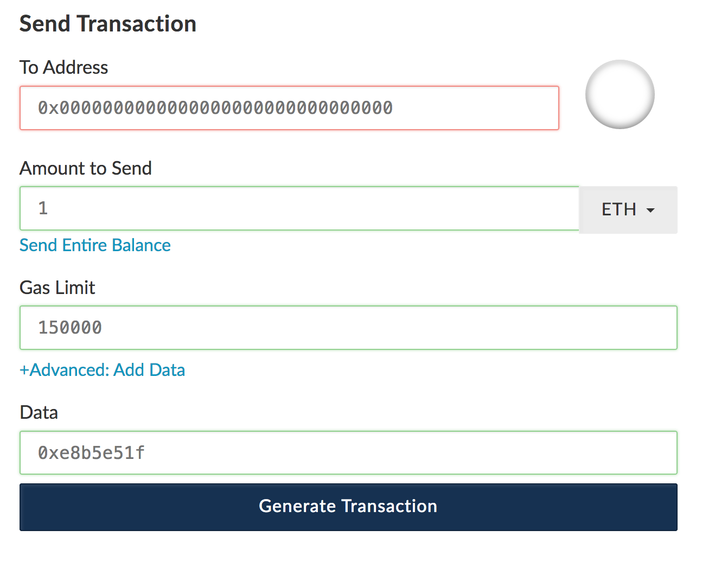

=====================
Command line commands
=====================

.. contents:: :local:

Introduction
============

Here are listed command line commands.

All commands read `populus.json` file for the chain configuration from the current working directory. The chain configuration should set up a Web3 HTTP provider how command line command talks to an Ethereum node. The Ethereum node must have an address with ETH balance for the operations.

deploy-presale
==============

A presale contract is a contract to collect presale investor money to be moved to a crowdsale when the crowdsale opens. The cresale contract can be deployed through ``presale`` command. After deploying the investors can call its ``invest()`` and ``refund()`` function from any Ethereum wallet allowing the transaction ``data`` field set.

.. code-block :: console

    presale --help

::

    Usage: presale [OPTIONS]

    Options:
      --chain TEXT     On which chain to deploy
      --address TEXT   Account to deploy from (must exist on geth)
      --days INTEGER   How many days presale is frozen for
      --minimum FLOAT  What is the minimum pre-ico buy in (ether)
      --help           Show this message and exit.

Example that deploys an immediately refundable (-1 days to refund) presale contract for testing on the mainnet.

.. code-block :: console

    deploy-presale --address=0x8888888888888888888 --days=-1 --minimum=0.001

::

    Make sure mainnet chain is running, you can connect to it, or you'll get timeout
    Web3 provider is RPC connection http://127.0.0.1:8545
    Deploy address is 0x8888888888888888888
    Deploy address balance is 0.80625992728132232
    Please provide the password to unlock account `0x8888888888888888888`.:
    Deploying presale, tx hash is XXX
    Presale contract address is YYYY
    Presale constructor arguments is 0000000000000000000000000000000000000000000000000000000058d9722800000000000000000000000000000000000000000000000000038d7ea4c68000
    Presale freeze ends at 1490645544
    Presale minimum buy in (wei) is 1000000000000000
    Presale.invest() estimated gas cost is 107700
    Presale.invest() data payload is 0xe8b5e51f
    Presale.refund() data payload is 0x590e1ae3
    All done! Enjoy your decentralized future.

Now you can make a invest transaction to the contract:

.. _deploy-token:

deploy-token
============

Deploy a crowdsale token contract.

::

    Usage: deploy-token [OPTIONS]

      Deploy a CrowdsaleToken contract.

      Example:

      deploy-token --chain=ropsten
      --address=0x3c2d4e5eae8c4a31ccc56075b5fd81307b1627c6 --name="MikkoToken
      2.0" --symbol=MOO --release-
      agent=0x3c2d4e5eae8c4a31ccc56075b5fd81307b1627c6  --supply=100000

    Options:
      --chain TEXT          On which chain to deploy - see populus.json
      --address TEXT        Address to deploy from and who becomes as a owner
                            (must exist on geth)  [required]
      --release-agent TEXT  Address that acts as a release agent (can be same as
                            owner)
      --minting-agent TEXT  Address that acts as a minting agent (can be same as
                            owner)
      --name TEXT           How many days presale is frozen for  [required]
      --symbol TEXT         What is the minimum pre-ico buy in (ether)  [required]
      --supply INTEGER      What is the minimum pre-ico buy in (ether)
      --help                Show this message and exit.

Example that deploys a crowdsale token to testnet and then sets the owner as a release agent:

.. code-block:: console

    deploy-token --chain=ropsten --address=0x3c2d4e5eae8c4a31ccc56075b5fd81307b1627c6 --name="MikkoToken 2.0" --symbol=MOO --release-agent=0x3c2d4e5eae8c4a31ccc56075b5fd81307b1627c6  --supply=100000

::

    Web3 provider is RPC connection http://127.0.0.1:8546
    Owner address is 0x3c2d4e5eae8c4a31ccc56075b5fd81307b1627c6
    Owner balance is 1427.411449177796571295 ETH
    Please provide the password to unlock account `0x3c2d4e5eae8c4a31ccc56075b5fd81307b1627c6`. []:
    Starting contract deployment
    Contract address is 0x513a7437d355293ac92d6912d9a8b257a343fb36
    CrowdsaleToken constructor arguments is 000000000000000000000000000000000000000000000000000000000000006000000000000000000000000000000000000000000000000000000000000000a000000000000000000000000000000000000000000000000000000000000186a000000000000000000000000000000000000000000000000000000000000000054d696b6b6f00000000000000000000000000000000000000000000000000000000000000000000000000000000000000000000000000000000000000000000034d6f6f0000000000000000000000000000000000000000000000000000000000
    Setting release agent to 0x3c2d4e5eae8c4a31ccc56075b5fd81307b1627c6
    Token owner: 0x3c2d4e5eae8c4a31ccc56075b5fd81307b1627c6
    Token minting finished: False
    Token released: False
    Token release agent: 0x3c2d4e5eae8c4a31ccc56075b5fd81307b1627c6
    All done! Enjoy your decentralized future.

