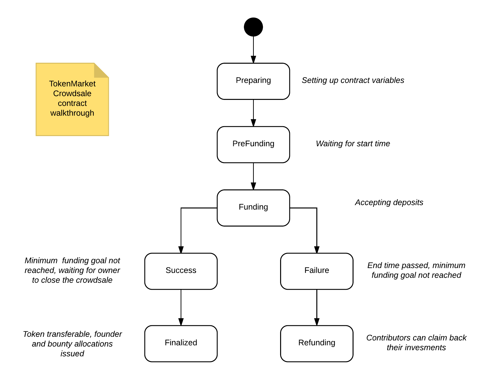

ICO smart contract and tool documentation
=========================================

This is a documentation for `ICO package <https://github.com/tokenmarketnet/ico>`_ providing Ethereum smart contracts and Python based command line tools for launching your ICO crowdsale or token offering.

`ICO stands for a token or cryptocurrency initial offering crowdsale <https://tokenmarket.net/what-is/ico>`_. It is a common method in blockchain space, decentralized applications and in-game tokens for bootstrap funding of your project.

This project aims to provide standard, secure smart contracts and tools to create crowdsales for Ethereum blockchain.

.. toctree::
   :maxdepth: 1
   :caption: Contents:

   intro
   contracts
   install
   commands
   interact
   verification
   test
   chain
   designchoices
   other
   support

Links
=====

`Github issue tracker and source code <https://github.com/tokenmarketnet/ico>`_

`Documentation <https://ico.readthedocs.io/en/latest/>`_
