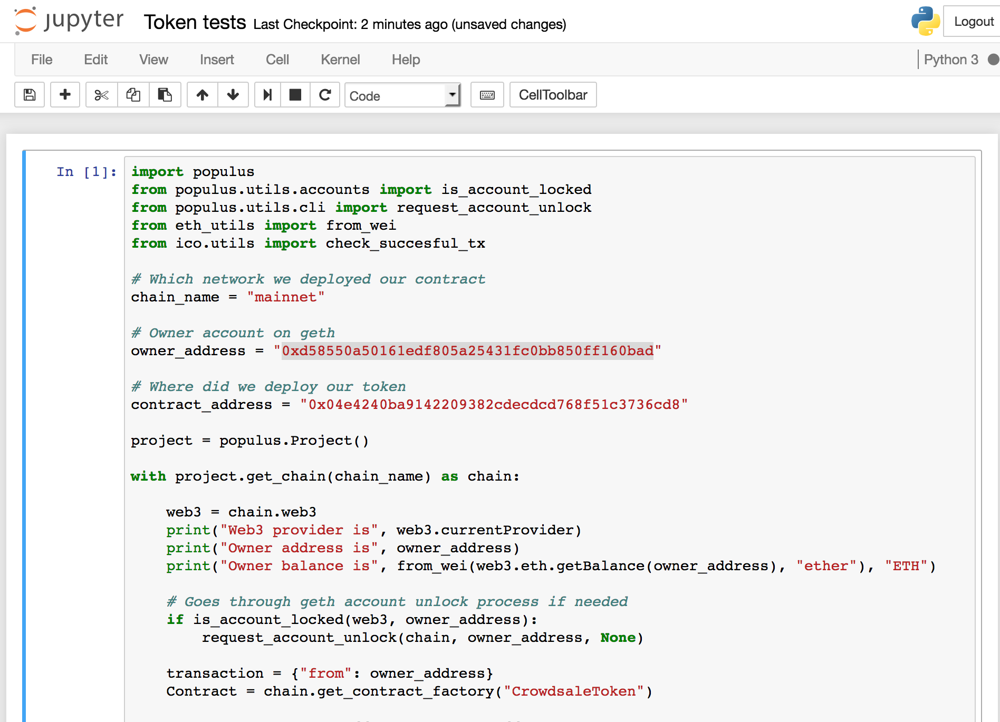
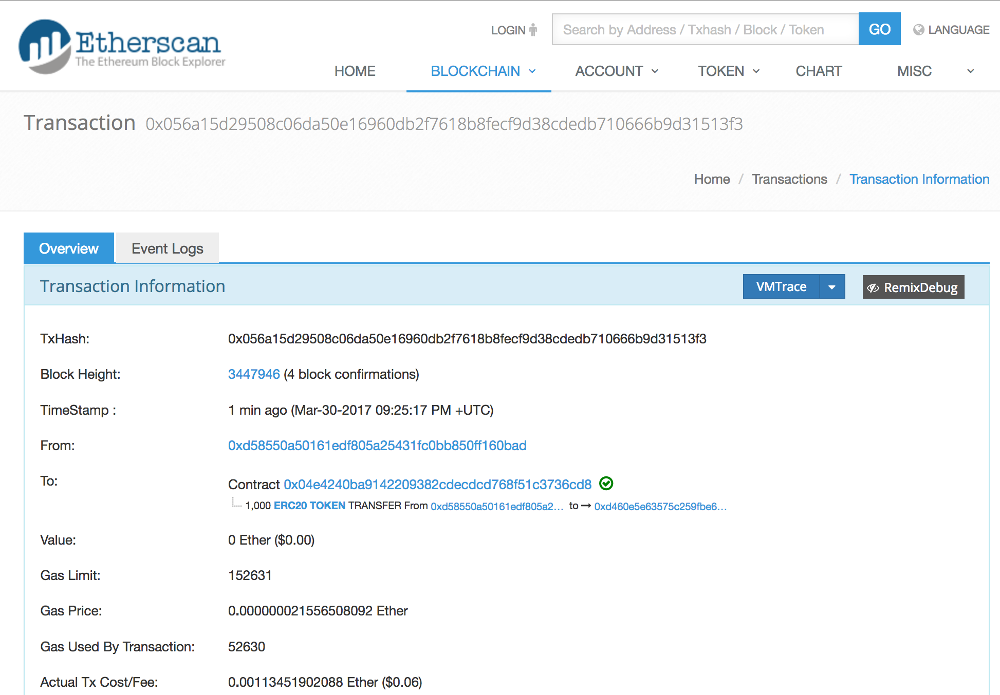
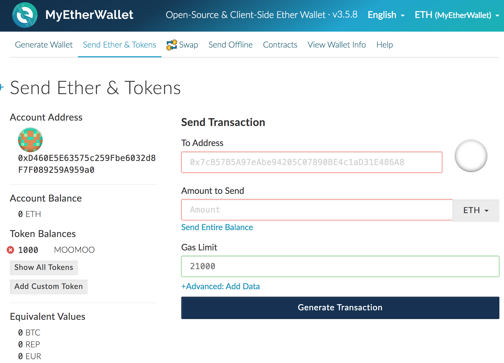

=========================================
Interacting with deployed smart contracts
=========================================

.. contents:: :local:

Introduction
============

This chapter shows how one can interact with deployed smart contracts.

Interaction is easiest through a Jupyter Notebook console where you can edit and run script snippets.

All snippets will connect to Ethereum node through a JSON RPC provider that has been configured in ``populus.json``.

Getting Jupyter Notebook
------------------------

Install it with `pip` in the activated Python virtual environment:

.. code-block:: console

    pip install jupyter

Then start Jupyter Notebook:

.. code-block:: console

    jupyter notebook

Releasing a token
=================

See :ref:`deploy-token` example how to deploy a crowdsale token contract that is transfer locked up by default. The crowdsale tokens cannot be transferred until the release agent makes the token transferable. As we set our owner address as the release agent we can do this from Python console.

Then copy and edit the following snippet with your address information:

.. code-block:: python

    import populus
    from populus.utils.accounts import is_account_locked
    from populus.utils.cli import request_account_unlock
    from eth_utils import from_wei
    from ico.utils import check_succesful_tx

    # Which network we deployed our contract
    chain_name = "ropsten"

    # Owner account on geth
    owner_address = "0x3c2d4e5eae8c4a31ccc56075b5fd81307b1627c6"

    # Where did we deploy our token
    contract_address = "0x513a7437d355293ac92d6912d9a8b257a343fb36"

    project = populus.Project()

    with project.get_chain(chain_name) as chain:

        web3 = chain.web3
        print("Web3 provider is", web3.currentProvider)
        print("Owner address is", owner_address)
        print("Owner balance is", from_wei(web3.eth.getBalance(owner_address), "ether"), "ETH")

        # Goes through geth account unlock process if needed
        if is_account_locked(web3, owner_address):
            request_account_unlock(chain, owner_address, None)

        transaction = {"from": owner_address}
        Contract = chain.get_contract_factory("CrowdsaleToken")

        contract = Contract(address=contract_address)
        print("Attempting to release the token transfer")
        txid = contract.transact(transaction).releaseTokenTransfer()
        check_succesful_tx(web3, txid)
        print("Token released")

Transfering tokens
==================

We have deployed a crowdsale token and made it transferable as above. Now let's transfer some tokens to our friend in Ropsten testnet.

* We create a Ropsten testnet wallet on `MyEtherWallet.com <https://myetherwallet.com/>`_ - in this example our MyEtherWallet address is 0x47FcAB60823D13B73F372b689faA9D3e8b0C48b5

* We include our deployed token contract there through *Add Custom Token* button

* Now let's transfer some tokens into this wallet through IPython console from our owner account

.. code-block:: python

    import populus
    from populus.utils.accounts import is_account_locked
    from populus.utils.cli import request_account_unlock
    from eth_utils import from_wei
    from ico.utils import check_succesful_tx

    # Which network we deployed our contract
    chain_name = "ropsten"

    # Owner account on geth
    owner_address = "0x3c2d4e5eae8c4a31ccc56075b5fd81307b1627c6"

    # Where did we deploy our token
    contract_address = "0x513a7437d355293ac92d6912d9a8b257a343fb36"

    # The address where we are transfering tokens into
    buddy_address = "0x47FcAB60823D13B73F372b689faA9D3e8b0C48b5"

    # How many tokens we transfer
    amount = 1000

    project = populus.Project()

    with project.get_chain(chain_name) as chain:

        Contract = chain.get_contract_factory("CrowdsaleToken")
        contract = Contract(address=contract_address)

        web3 = chain.web3
        print("Web3 provider is", web3.currentProvider)
        print("Owner address is", owner_address)
        print("Owner balance is", from_wei(web3.eth.getBalance(owner_address), "ether"), "ETH")
        print("Owner token balance is", contract.call().balanceOf(owner_address))

        # Goes through geth account unlock process if needed
        if is_account_locked(web3, owner_address):
            request_account_unlock(chain, owner_address, None)

        transaction = {"from": owner_address}

        print("Attempting to transfer some tokens to our MyEtherWallet account")
        txid = contract.transact(transaction).transfer(buddy_address, amount)
        check_succesful_tx(web3, txid)
        print("Transfered", amount, "tokens to", buddy_address, "in transaction https://ropsten.etherscan.io/tx/{}".format(txid))

We get output like::

    Web3 provider is RPC connection http://127.0.0.1:8546
    Owner address is 0x3c2d4e5eae8c4a31ccc56075b5fd81307b1627c6
    Owner balance is 1512.397773239968990885 ETH
    Owner token balance is 99000
    Attempting to transfer some tokens to our MyEtherWallet account
    Transfered 1000 tokens to 0x47FcAB60823D13B73F372b689faA9D3e8b0C48b5 in transaction https://ropsten.etherscan.io/tx/0x5460742a4f40dd573aeadedde95fc57fff6de800dde9494520c4f7852d7a956d

Etherscan transfer confirmation
-------------------------------

We can see `the transaction in the blockchain explorer <https://twitter.com/tokenmarket/status/847556407033573376>`_:

MyEtherWallet transfer confirmation
-----------------------------------

And then finally we see tokens in our MyEtherWallet:

